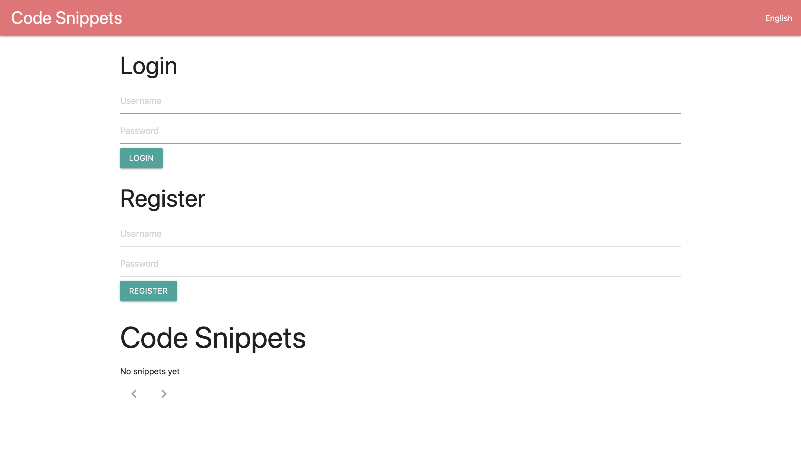
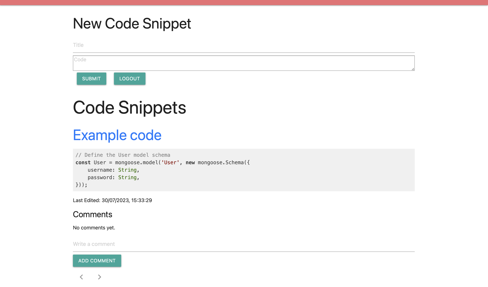
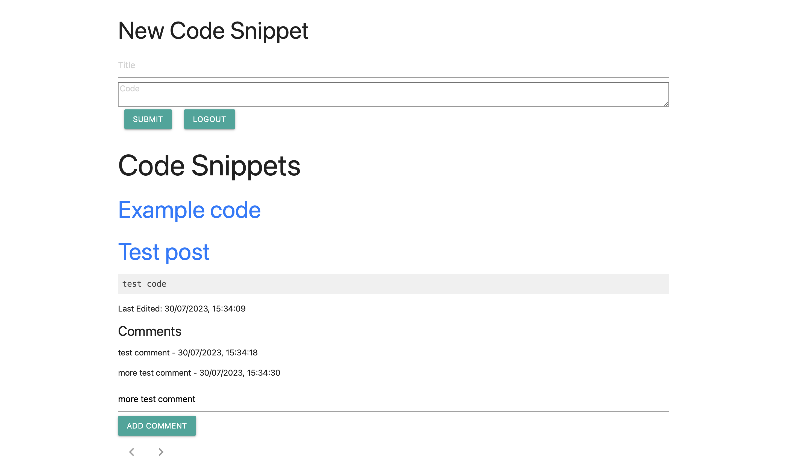

# Code Snippets App Documentation

Made by David Aron Vigh

This documentation provides an overview of the Code Snippets app, explaining its technology choices, installation guidelines, and user manual. Additionally, it lists the implemented features.

## Technology Choices

The Code Snippets app uses the following technologies:

- **Backend:**
  - Node.js with Express for the server-side application.
  - MongoDB for the database.
  - Mongoose for object data modeling.
  - `dotenv` for managing environment variables.
  - `body-parser` for parsing incoming request bodies.
  - `jsonwebtoken` for generating and verifying JSON Web Tokens (JWT).
  - `bcrypt` for hashing passwords securely.
  - `cors` for enabling Cross-Origin Resource Sharing.

- **Frontend:**
  - HTML, CSS, and JavaScript.
  - Materialize CSS for responsive design and styling.
  - Highlight.js for syntax highlighting of Javascript code snippets.

## Installation Guidelines

Follow the steps below to install and set up the Code Snippets app:

1. Clone the repository from GitHub.
2. Make sure you have Node.js and MongoDB installed on your system.
3. Navigate to the project's root directory and run `npm install` to install the required dependencies.
4. Create a `.env` file in the root directory and set the following environment variables:
   ```
   PORT=3000
   MONGODB_URI=<your-mongodb-connection-string>
   SECRET_KEY=<your-secret-key-for-jwt>
   ```
   Replace `<your-mongodb-connection-string>` with the MongoDB connection string you want to use. The `SECRET_KEY` is an optional field that can be used for JWT token generation. If not provided, a default value will be used.
5. Start the server by running `npm start` or `node index.js`. The server will run on `http://localhost:3000` by default. You can change the port in the `.env` file.
6. Open the `index.html` file in a web browser to access the frontend of the app.

## User Manual

### Registration and Login

1. On the main page, you will find two forms: "Login" and "Register."
2. To register, fill in the "Register" form with a unique username and a password. Click the "Register" button.
3. To log in, fill in the "Login" form with your registered username and password. Click the "Login" button.
4. After successful registration or login, the "New Code Snippet" form will be visible, and the "Login" and "Register" forms will be hidden.
5. To log out, click the "Logout" button. This will clear your authentication token and hide the "New Code Snippet" form.

### Submitting a New Code Snippet

1. After logging in, the "New Code Snippet" form will be visible.
2. Fill in the "Title" and "Code" fields with the desired snippet details.
3. Click the "Submit" button to post the new code snippet.
4. A success message will be displayed, and the new snippet will be added to the list of snippets.

### Viewing Code Snippets

1. On the main page, you will see a list of code snippets.
2. Click on the title of a snippet to expand it and view the code and the last edited date.
3. Click again to collapse the snippet.

### Adding Comments to a Snippet

1. After expanding a snippet, you will see a "Comments" section.
2. If you are logged in, a comment form will be visible below the "Comments" section.
3. Enter your comment in the input field and click the "Add Comment" button to add the comment to the snippet.
4. The comments are displayed with their respective timestamps.

### Pagination

1. The snippets are paginated, with ten snippets per page.
2. You can navigate between pages using the pagination buttons at the bottom.

### Language Selection

The Code Snippets app supports two languages: English and German. Users can easily switch between these languages.

1. At the top-right corner of the app's navigation bar, you will find a "Language" toggle button.
2. By default, the app is set to English. Click the "Language" toggle button to switch to German.
3. Click the button again to switch back to English.
4. When you switch the language, all text elements within the app, including labels, buttons, and messages, will be updated to the selected language.

## Implemented Features

- User registration and login with password hashing for security.
- JWT-based authentication for protected routes.
- Submitting new code snippets with titles and code content.
- Fetching and displaying paginated code snippets.
- Expanding and collapsing individual code snippets to view their details.
- Adding comments to specific snippets and displaying them with timestamps.
- Language toggle feature to switch between English and German.





## Number of points implemented

- Basic features (25 points)
- Use of highlight library (2 points)
- Use of pager (2 points)
- Last edited timestamp is stored and shown (2 points)
- Translation of the UI in two languages (2 points)

Please note that this documentation provides an overview of the Code Snippets app, its features, and how to use it. For more in-depth implementation details, refer to the source code files `index.js` (backend) and `index.html` (frontend).

The help of ChatGPT was used for the completion of the project.